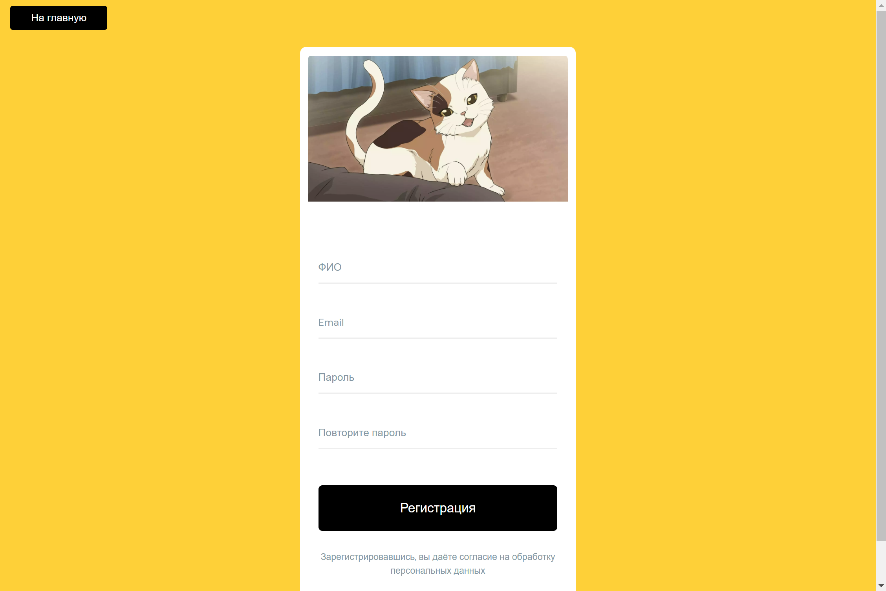
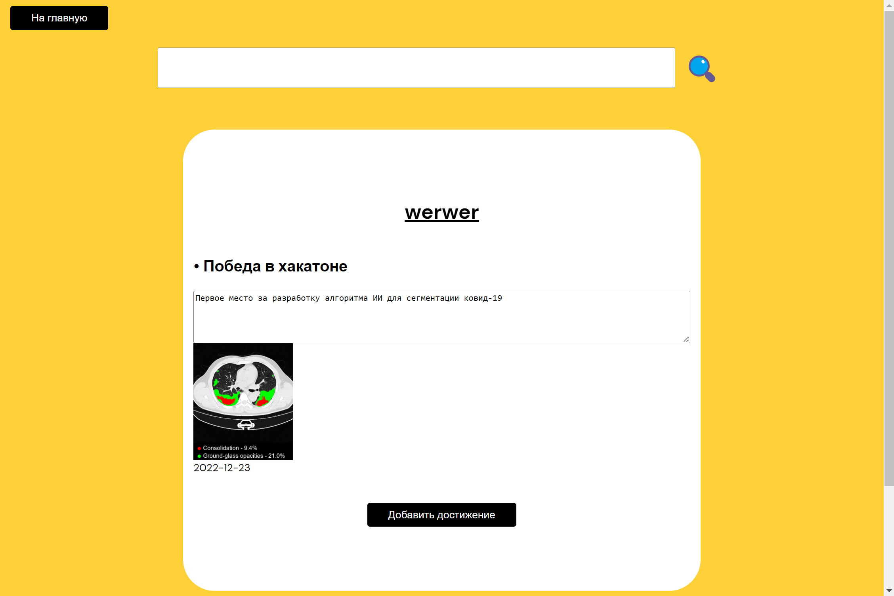

# OnlineResumeService

## Overview

It's my main project in Yandex Lyceum.
I made a web-service for creating resumes.

## Functionality

* Account system
* Email confirmation (not active cause of unpaid email service)
* Resume creation with image
* Resume incognito mode
* Search users boards with resume

## Looks like

Registration page


Board page


## Run code

Clone this repository

```bash
git clone https://github.com/werserk/OnlineResumeService.git
```

Install requirements

```bash
pip install -r requirements.txt
```

Create .env file in root directory and fill it with your data

```
HOST=smtp.yandex.ru
PORT_MAIL=<your mail port>
PORT=<your port>
FROM=<your email@yandex.ru>
PASSWORD=<password to email>
SECRET_KEY=<your secret key>
```

Run server

```bash
python main.py
```